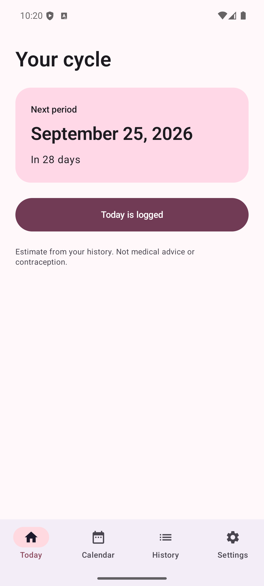
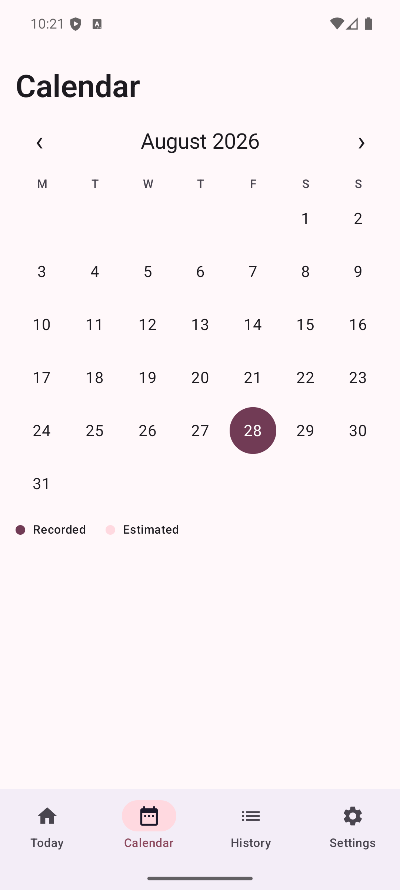
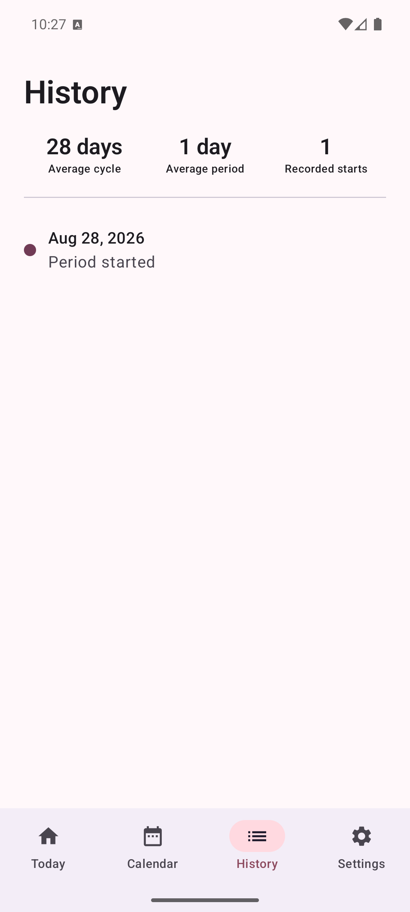
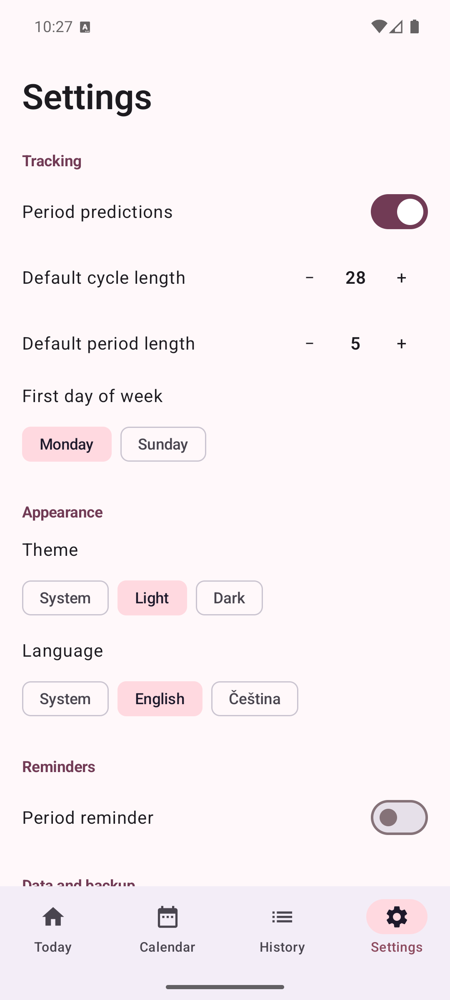

# Selia Cycles

[](https://github.com/Majkey25/SeliaCycles/actions/workflows/android.yml)
[](https://developer.android.com/about/versions/10)
[](LICENSE)

<p align="center">
  
</p>

Selia Cycles is a private period tracker for Android. It records bleeding, flow, symptoms, mood, and notes without an account, ads, analytics, or app internet access.

## Features

- Today, calendar, history, and settings screens in Material 3.
- Period estimates based on up to six recent complete cycles.
- Czech and English app languages.
- System, light, and dark themes.
- Optional local period reminders.
- Password-encrypted `.seliabackup` export and atomic restore.
- Android Auto Backup for the selected Google or device backup account.
- Optional read-only import of menstrual period and flow records from Health Connect.
- One-action deletion of all local app data.

## Data migration limits

Android does not let one app read another app's private Google or Samsung account backup. Selia Cycles imports standard Health Connect menstrual records when a source app publishes them. Current Samsung Health documentation does not list cycle records among its Health Connect data types, and My Calendar does not publish a compatible backup format.

## Screenshots

| Today | Calendar |
| --- | --- |
|  |  |

| History | Settings |
| --- | --- |
|  |  |

## Build

Requirements: JDK 17 and Android SDK 36.

```bash
./gradlew testDebugUnitTest lintDebug assembleDebug bundleRelease --console=plain
```

The default release bundle is unsigned. Publication uses an external upload keystore that is never committed. See [release signing and publication](docs/RELEASE.md).

## Privacy

See the [privacy policy](PRIVACY.md) and [Google Play declarations](docs/play-store/DATA_SAFETY.md). The hosted policy lives at `https://majkey25.github.io/SeliaCycles/` after GitHub Pages deploys.

## Medical scope

Selia Cycles provides calendar estimates, not diagnosis, ovulation confirmation, or contraception. The in-app information links to WHO guidance. Users should contact a healthcare professional about severe pain, very heavy bleeding, bleeding between periods, or major changes in their usual pattern.

## Support

Use [GitHub Issues](https://github.com/Majkey25/SeliaCycles/issues) for bugs. For privacy questions, email [majkeylab@gmail.com](mailto:majkeylab@gmail.com).

## License

Copyright © 2026 Majkey25. Licensed under the [Apache License 2.0](LICENSE).
